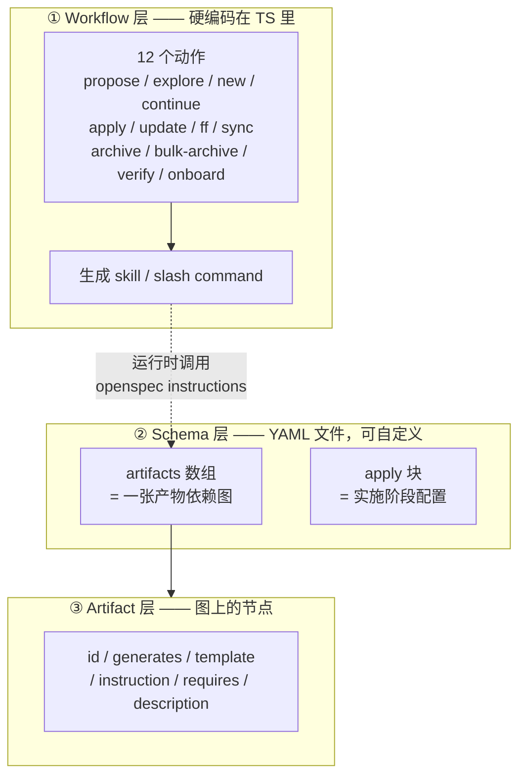
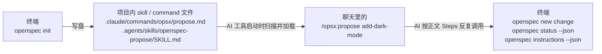
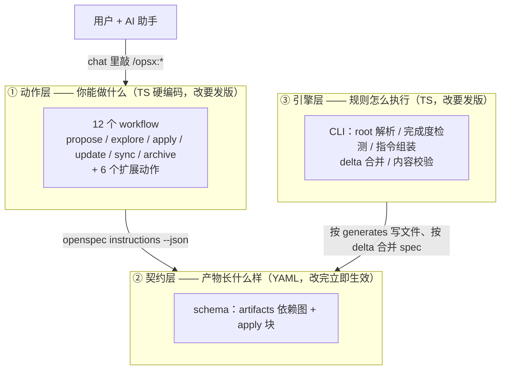

# OpenSpec 学习笔记

个人学习笔记，用于记录阅读 `docs/` 与 `src/` 后对 OpenSpec 内部机制的核实结论。每条结论都标注了对应源码位置，方便日后回归验证。

> 核实方式：直接阅读源码，而非仅依据文档描述。

> 章节安排：第 1 章是概念澄清（Workflow / Schema / Artifact 三个词到底指什么），第 2–4 章是 OPSX 源码研究，第 5 章是整体心智模型与典型流程，第 6 章是源码索引，第 7 章是后续待研究项。

---

## 1. Workflow、Schema、Artifact 概念理解

### 1.1 先记住一句话

> **Workflow** 是可随时调用的**动作**，**Schema** 是一张**产物依赖图**，**Artifact** 是图上的**节点**。
>
> 前一个与后两个**零代码耦合**；后两个是「容器与内容」的关系。

### 1.2 三个词的正确定位

| 词                 | 是什么                                                               | 谁定义                          | 数量         | 改动成本               |
| ------------------ | -------------------------------------------------------------------- | ------------------------------- | ------------ | ---------------------- |
| **Workflow** | 一个**动作**（action），如 `propose`、`apply`、`archive` | TS 常量`ALL_WORKFLOWS`        | 12 个，固定  | 改源码 + 发新版        |
| **Schema**   | 一套**产物依赖图** + 实施阶段配置                              | `schema.yaml`                 | 可自定义     | 改完**立即生效** |
| **Artifact** | 依赖图里的**一个节点**（一个产物）                             | schema 的`artifacts[]` 的一项 | 随 schema 变 | 改完**立即生效** |



**图中只有一条虚线**，也就是唯一的联系：skill 在运行时去查 schema，拿到提示词再写文件。除此之外没有任何代码引用关系。

### 1.3 Workflow 是「动作」，不是「阶段」

这是最反直觉的一点。直觉上会以为 `/opsx:propose → /opsx:apply → /opsx:archive` 是一条必经流程，实际不是。

```text
直觉上的（阶段序列）：
  propose ──► apply ─► verify ──► archive
  （有序、必须逐阶段前进）

实际的（动作集合）：
  ┌─────────┐  ┌─────────┐  ─────────┐  ┌─────────┐
  │ propose │  │  apply  │  │ verify  │  │ archive │
  └─────────┘  └─────────┘  └─────────┘  ─────────┘
  （并列、无序、随时可调用；顺序由使用者组合）
```

源码证据：

- `ALL_WORKFLOWS`（`src/core/profiles.ts`）只是一个**扁平的 readonly 数组**，没有任何顺序字段，也没有任何依赖字段。
- 每个 workflow 的 skill 正文都能独立跑通，不检查「上一个阶段是否完成」。
- `docs/concepts.md` 明确写 **"Actions, not phases — create, implement, update, archive — do any of them anytime"**；`docs/workflows.md` 的开篇标题就是 **"Philosophy: Actions, Not Phases"**。
- 那条线性流程来自 `docs/workflows.md` 的 **"Workflow Patterns"** 一节——那是**面向用户的推荐组合**，不是系统强制的机制。默认 `core` profile 里甚至没有 `verify`。

**修正说法**：workflow 是「你能做的动作」，不是「你要走的流程」。顺序是使用习惯，不是机制约束。

补充一点：**workflow 不覆盖「产物」**。`propose` 和 `ff` 是两个不同动作，却能产出同一批 artifact——它们不是两个「环节」。

12 个 workflow 及其对应的 skill 目录（`WORKFLOW_TO_SKILL_DIR`，`src/core/profile-sync-drift.ts`）：

| Workflow id      | 是否在默认`core` profile | Skill 目录                       |
| ---------------- | -------------------------- | -------------------------------- |
| `propose`      | ✅                         | `openspec-propose`             |
| `explore`      | ✅                         | `openspec-explore`             |
| `apply`        | ✅                         | `openspec-apply-change`        |
| `update`       | ✅                         | `openspec-update-change`       |
| `sync`         | ✅                         | `openspec-sync-specs`          |
| `archive`      | ✅                         | `openspec-archive-change`      |
| `new`          | ❌ 需`config profile`    | `openspec-new-change`          |
| `continue`     | ❌                         | `openspec-continue-change`     |
| `ff`           | ❌                         | `openspec-ff-change`           |
| `verify`       | ❌                         | `openspec-verify-change`       |
| `bulk-archive` | ❌                         | `openspec-bulk-archive-change` |
| `onboard`      | ❌                         | `openspec-onboard`             |

注意「命令名 ≠ skill 名」：`/opsx:apply` 背后是 `openspec-apply-change` skill，`/opsx:sync` 背后是 `openspec-sync-specs`。

### 1.4 Workflow 与 Schema 之间没有任何关系

这是最主要的误解来源。

| 验证项                                           | 结果                                    |
| ------------------------------------------------ | --------------------------------------- |
| `ALL_WORKFLOWS` 里出现过任何 artifact id 吗？  | 没有                                    |
| schema 能声明「本 schema 使用哪些 workflow」吗？ | 不能，`SchemaYamlSchema` 没有这个字段 |
| 换成`rapid` schema 后 workflow 数量会变吗？    | **不会**，永远是那 12 个          |
| 新增自定义 schema 会多出 slash command 吗？      | **不会**                          |

真正的类比：

- **workflow = 动词**（我要 propose / 我要 apply）
- **schema = 名词表**（propose 出来的东西长什么样、apply 时该读哪个文件）

> ⚠️ `docs/customization.md` 里说的是 schema 用于 "Define your own workflow artifacts"，这里的 "workflow" 是**泛指「产物序列」**，不是指那 12 个动作。这是文档措辞造成的混淆源。

### 1.5 Artifact 与 Schema：容器与内容

Schema 定义「有哪些产物节点、怎么依赖、怎么写」，Artifact 就是被定义的每一项。

#### 1.5.1 一个 artifact 的全部字段

`ArtifactSchema`（`src/core/artifact-graph/types.ts`）：

| 字段            | 必填 | 说明                                                                     |
| --------------- | ---- | ------------------------------------------------------------------------ |
| `id`          | 是   | 唯一标识。只校验非空，**不强制 kebab-case**                        |
| `generates`   | 是   | 输出文件名或 glob（如`specs/**/*.md`）。必须相对路径，禁止 `..` 逃逸 |
| `description` | 是   | 在`status` / `instructions` 中展示                                   |
| `template`    | 是   | `templates/` 目录下的相对路径                                          |
| `instruction` | 否   | 给模型的写作指导                                                         |
| `requires`    | 否   | 依赖的 artifact id 列表，默认`[]`                                      |

`parseSchema()`（`src/core/artifact-graph/schema.ts`）额外做三项结构校验：重复 id、`requires` 指向不存在的 id、依赖环（DFS 报完整环路径）。

#### 1.5.2 提示词是「四份输入」拼起来的

schema 只负责其中两份，这是理解 `id` 用途的关键：

```xml
<project_context>   ← 来自 openspec/config.yaml 的 context       （对所有 artifact 生效）
<rules>             ← 来自 config.yaml 的 rules[<artifact-id>]   （按 id 精确匹配）
<dependencies>      ← 来自依赖节点的实际文件内容                  （从磁盘现读）
<instruction>       ← 来自 schema 的 artifact.instruction  ┐
<template>          ← 来自 schema 的 artifact.template     ┘ schema 提供这两份
<output>            ← 来自 schema 的 artifact.generates（派生为 resolvedOutputPath）
```

组装逻辑在 `generateInstructions()`（`src/core/artifact-graph/instruction-loader.ts`）。

所以更准确的说法是：**schema 定义「结构骨架 + 写作指导」，项目 config 定义「团队约束」（context 全局生效，rules 按 artifact id 生效）。**

#### 1.5.3 `generates` 主要不是给模型看的

`template` 和 `instruction` 确实是给模型看的，但 `generates` 的首要角色是**机器契约**：

| `generates` 的用途                                    | 代码位置                      | 谁在用 |
| ------------------------------------------------------- | ----------------------------- | ------ |
| 判定 artifact 是否完成（只看文件是否存在）              | `artifact-graph/state.ts`   | CLI    |
| glob 展开（`specs/**/*.md` → 实际文件列表）          | `artifact-graph/outputs.ts` | CLI    |
| 解析写入路径 / 校验不逃逸                               | `resolveArtifactOutputPath` | CLI    |
| **`skip_specs` 检测（是否以 `specs/` 开头）** | `isSpecsArtifactPath`       | CLI    |
| **`apply.tracks` 值匹配**                       | `task-progress.ts`          | CLI    |
| **`apply.requires` 门禁检查**                   | `workflow/instructions.ts`  | CLI    |

模型只收到派生出来的 `resolvedOutputPath`，后面三条纯属 CLI 内部逻辑。

> ⚠️ 这解释了一个坑：把 spec 产物挪出 `specs/` 目录，模型照样能写，但 `skip_specs` 会失灵——那条链不看 `id`、不看 `instruction`，**只看路径前缀**。

#### 1.5.4 三种「顺序」别混在一起

| 顺序               | 来源                     | 作用                                                                   |
| ------------------ | ------------------------ | ---------------------------------------------------------------------- |
| 依赖顺序           | `requires`             | 决定`ready` / `blocked`。**不是硬门禁**（文件存在即算 done） |
| **声明顺序** | `artifacts[]` 数组位置 | **并列时决定推荐先做哪个**                                       |
| workflow 顺序      | 不存在                   | —                                                                     |

第二条容易被忽略：`ArtifactGraph.compareByDeclarationOrder`（`src/core/artifact-graph/graph.ts`）用**数组下标**打破依赖图的并列。例如 `specs` 和 `design` 都只依赖 `proposal`，会同时进入 ready；此时谁在 `artifacts[]` 里靠前，CLI 就推荐谁先写。源码注释说明这是为了让推荐顺序与 schema 作者写下的 `proposal → specs → design → tasks` 保持一致。

### 1.6 Schema 的完整结构

顶层字段由 `SchemaYamlSchema` 校验：

| 字段            | 必填 | 约束                          |
| --------------- | ---- | ----------------------------- |
| `name`        | 是   | 非空，通常与所在目录名一致    |
| `version`     | 是   | 正整数                        |
| `description` | 否   | 用于`openspec schemas` 展示 |
| `artifacts`   | 是   | 至少 1 个                     |
| `apply`       | 否   | 实施阶段配置                  |

`apply` 块是比 `artifacts` 更接近「门禁」的部分：

```yaml
apply:
  requires: [tasks]      # apply 前必须存在的产物；缺失则 state = blocked
  tracks: tasks.md       # 勾选进度按哪个文件统计
  instruction: |         # apply 阶段的指导语
```

处理逻辑在 `src/commands/workflow/instructions.ts`：`apply.requires` 缺省时回退为「全部 artifacts」；`tracks` 是一个**文件名**，用于**选中**某个 artifact（匹配其 `generates` 值），再取该 artifact 的 `generates` 作为进度来源。

### 1.7 Schema 文件 vs Schema 名称：两条独立的解析链

**（a）schema 文件去哪找** —— `getSchemaDir()`（`src/core/artifact-graph/resolver.ts`）：

1. `<projectRoot>/openspec/schemas/<name>/schema.yaml`（项目级）
2. `<XDG_DATA_HOME>/openspec/schemas/<name>/schema.yaml`（用户级）
3. `<package>/schemas/<name>/schema.yaml`（包内置）

三者同名时，靠前者**遮蔽**（shadow）后者。用 `openspec schema which <name>` 查看解析来源。

**（b）schema 名称怎么定** —— `resolveSchemaForChange()`（`src/utils/change-metadata.ts`）：

1. `--schema <name>` 命令行参数
2. 变更目录下 `.openspec.yaml` 的 `schema` 字段
3. `openspec/config.yaml` 的 `schema` 字段
4. 默认 `spec-driven`

### 1.8 `openspec init` 与 schema 的关系

- **没有 `--schema` 参数**：`src/cli/index.ts` 的 init 只接受 `--tools` / `--language` / `--force` / `--profile` / `--animation` / `--copilot-cloud`。初始 schema 恒为 `spec-driven`，改默认值只能手改 `config.yaml`，或建变更时用 `openspec new change <name> --schema <other>`。
- **不复制 `schemas/` 目录**：`createDirectoryStructure()` 只建 `openspec/`、`specs/`、`changes/`、`changes/archive/`。项目里的 `openspec/schemas/` 只在 `openspec schema init` / `schema fork` 之后才出现。
- `openspec schema *` 命令组标注为 **experimental**，每次执行都会打印提示。

### 1.9 skill 与 schema 的分工

| 维度             | skill / command                                     | schema artifact                                  |
| ---------------- | --------------------------------------------------- | ------------------------------------------------ |
| 回答的问题       | **怎么做这个动作**（编排 + 护栏）             | **这个产物长什么样**                       |
| 是否随 schema 变 | **不变**（schema 无关）                       | 就是 schema 的内容                               |
| 何时冻结         | `openspec init` / `update` 那一刻从 TS 模板生成 | 每次`openspec instructions` 调用时从 YAML 现读 |
| 改了之后         | 需要跑`openspec update`                           | **立即生效**                               |

skill 正文里明确写了这一点（`src/core/templates/workflows/continue-change.ts`）：

> The artifact types and their purpose depend on the schema. The `instruction` field from the instructions output is the authoritative guidance for each artifact - follow it even when the artifact has a familiar name (proposal.md, tasks.md, etc.)...
>
> Use the schema's artifact sequence, don't assume specific artifact names

所以 skill 提供的是**通用编排骨架**，具体怎么写一律**运行时现查**。这也是换 schema 无需重新生成 skill 的原因。

这正是 `docs/opsx.md` 对比图想表达的：

```text
Legacy:  提示词硬编码在包里 ──► 等新版本发布 ──► 只能等待改进
OPSX:    schema.yaml ────────► 改完立刻生效 ──► 自己随时测
```

### 1.10 一个被删掉的旧绑定（理解混淆的成因）

`schema.yaml` 里 `id: proposal` 与任何 slash command **没有任何代码联系**。但这个联想并非凭空产生——OpenSpec 里存在**三个独立的命名空间**：

| 命名空间                 | 形态                                                               | 数量          | 定义位置                       |
| ------------------------ | ------------------------------------------------------------------ | ------------- | ------------------------------ |
| **workflow**       | `/opsx:propose`、`/opsx:apply` …                              | 12 个，硬编码 | `src/core/profiles.ts`       |
| **artifact id**    | `proposal`、`specs`、`design`、`tasks`                     | 随 schema     | `schema.yaml`                |
| **legacy command** | `/openspec:proposal`、`/openspec:apply`、`/openspec:archive` | 3 个，已废弃  | `src/core/legacy-cleanup.ts` |

**历史成因**：OPSX 之前的旧工作流，命令**确实**是照着产物命名的（`/openspec:proposal`），而且提示词**硬编码在 TypeScript 里**。`docs/opsx.md` 开篇列的旧工作流第一个缺点就是 *"Instructions are hardcoded — buried in TypeScript, you can't change them"*。

也就是说，**旧设计里「命令」和「产物」是绑定的**。OPSX 的改造重点正是解开这个绑定：把硬编码提示词外移到 schema，于是 artifact 变成纯数据、纯参数，命令变成纯「动作」。

**三个能直接验证「无关」的观察**：

1. `rapid` schema 只有 `proposal` + `tasks`（没有 `specs`、`design`），但 slash command 数量**一个都不会少**。
2. `/opsx:propose` 这个动作在 `ALL_WORKFLOWS` 里叫 `propose`，而 artifact 里那个叫 `proposal`——**连拼写都不同**。
3. `docs/customization.md` 里那段 YAML 只是通用示例，恰好与 `spec-driven` 同构，纯属示范方便。

### 1.11 Artifact id 的全部作用

`id` 的作用范围**只有 CLI 的一个参数位**：

```bash
openspec instructions <artifact-id> --change <name> --json
                              ↑ 唯一入口，id 在这里被校验
```

`instructionsCommand` 会拿 id 去 `context.graph.getArtifact(artifactId)` 查；查不到就报错并列出当前 schema 的合法 id（`src/commands/workflow/instructions.ts`）。

自定义一个 id（例如 `research`）的完整影响：

| 影响                                                      | 说明                                                                                  |
| --------------------------------------------------------- | ------------------------------------------------------------------------------------- |
| ✅`openspec instructions research --change <name>` 可用 | 主力用途                                                                              |
| ✅ 出现在`openspec status --json` 的 `artifacts[]`    | 状态为`done` / `ready` / `blocked` / `skipped`                                |
| ✅ 出现在`openspec templates` 映射                      | 模板路径可解析                                                                        |
| ✅ 成为依赖图节点                                         | 被`requires` 或 `apply.requires` 引用时，会真实影响 ready / blocked 与 apply 门禁 |
| ✅ 可作为 config 的 rules key                             | `rules.research: [...]` 生效                                                        |
| ✅ 可被`apply.tracks` 选中                              | 若`tracks: research.md`，进度统计改从它读                                           |
| ❌**不会**产生 skill                                | workflow 列表硬编码，加不进去                                                         |
| ❌**不会**产生 slash command                        | 同上                                                                                  |
| ⚠️ 若`generates` 以 `specs/` 开头                   | 会被`skip_specs` 机制接管（只看路径前缀，不看 id）                                  |

#### ⚠️ 两个保留 id

```ts
// src/cli/index.ts
// Workflow instruction surfaces are reserved command branches, not artifacts.
if (artifactId === 'apply') {
  await applyInstructionsCommand(options);
} else if (artifactId === 'archive') {
  await archiveInstructionsCommand(options);
}
```

`openspec instructions <artifact>` 的第一个参数位会被 lane 分流：`apply` / `archive` 被解释为**实施 / 归档阶段的指令入口**，而不是 artifact id。

因此 `apply` 和 `archive` 是**事实上的保留 id**——在自定义 schema 里定义它们**能通过校验**，但**永远取不到它们的 artifact 提示词**。除此之外没有任何 id 冲突。

#### 其他 id 约束

- **不强制 kebab-case**：`ArtifactSchema` 只校验 `z.string().min(1)`。这与 schema **名**不同（`isValidSchemaName` 才校验 kebab-case）。但仍建议用 kebab-case 便于命令行输入。
- **必须唯一**：重名抛 `Duplicate artifact ID`。
- **`requires` 引用的 id 必须存在**：否则抛 `Invalid dependency reference`。
- **`template` 文件必须真实存在**：`openspec schema validate` 会检查（`src/commands/schema.ts`）。
- **不做跨 schema 解析**：id 只在「当前 change 所用 schema」的图里查。

### 1.12 概念速查表

| 你可能以为                              | 实际上                                                                                        |
| --------------------------------------- | --------------------------------------------------------------------------------------------- |
| workflow 是有序的阶段流程               | workflow 是并列的可独立调用动作；顺序是使用习惯                                               |
| workflow 由 schema 定义                 | workflow 硬编码在`src/core/profiles.ts`，与 schema 无关                                     |
| artifact id 会变成 slash command        | id 只是`openspec instructions <id>` 的查询键                                                |
| 一个 artifact 对应一个 skill            | 两套独立体系，无对应关系                                                                      |
| schema 定义「怎么写这个文件」的全部     | 只提供`template` + `instruction` + `generates`；`context` / `rules` 来自项目 config |
| `generates` 是给模型看的输出提示      | 首要角色是机器契约（完成判定 / glob / skip_specs / tracks）                                   |
| artifact 依赖是硬门禁                   | 不是。文件存在即算 done，但状态与推荐顺序受依赖影响                                           |
| `apply.tracks: tasks.md` 是按文件名找 | 是按该值匹配某 artifact 的`generates`；id 为 `tasks` 只是兜底                             |
| `skip_specs` 按 artifact id 生效      | 按`generates` 是否以 `specs/` 开头生效                                                    |
| 自定义 schema 能新增一个 workflow       | 不能。workflow 列表是硬编码常量                                                               |
| id 可以随便取                           | 除`apply` / `archive` 外随便取；这两个是 CLI 保留字                                       |

### 1.13 疑问记录（QA）

> 这里保留学习过程中实际提出的疑问与澄清结论，便于日后回看思路。

#### Q1. Workflow 与 Artifact 的详细含义是什么？workflow 是否就是「propose → apply → verify → archive」这条流程，每个环节对应一个 slash command？

**半对。** slash command 与 workflow 确实是 1:1（12 个 workflow 硬编码生成 12 个 skill / command）。但 workflow **不是阶段序列，而是并列的动作集合**——`ALL_WORKFLOWS` 只是扁平数组，没有顺序或依赖字段，每个 skill 都能独立跑通。

那条 `propose → apply → verify → archive` 的线性感来自 `docs/workflows.md` 的 **"Workflow Patterns"**，是**用户级推荐组合**，不是机制。默认 `core` profile 里甚至没有 `verify`。

另外 workflow 只覆盖「动作」，不覆盖「产物」：`propose` 和 `ff` 是两个动作，却能产出同一批 artifact。

#### Q2. Workflow 和 Schema 是什么关系？workflow 的定义就是 schema 吗？

**不是，两者完全无关。**

- workflow = `src/core/profiles.ts` 里的 TS 常量，改动要发新版。
- schema = YAML 文件，改完立即生效。
- schema 里**没有任何字段**能声明要使用哪些 workflow；换 schema 后 workflow 数量不会变；新增 schema 也不会多出任何 command。

`docs/customization.md` 说 schema 用于 "Define your own workflow artifacts"，这里的 "workflow" 是**泛指产物序列**，不是那 12 个动作——这是文档措辞造成的混淆源。

**类比**：workflow = 动词，schema = 名词表。

#### Q3. Artifact 与 Schema 是什么关系？每类文档产物的规范是由 schema 定义的吗？schema 里的依赖关系与 workflow 顺序有关吗？

**前半对，后半无关。**

- artifact 的完整提示词是**四份输入**拼起来的，schema 只提供其中两份（`template` + `instruction`，外加 `generates` 派生的输出路径）；`context` 与 `rules` 来自项目 `openspec/config.yaml`。
- 依赖关系与 workflow **完全无关**。需要区分三种「顺序」：`requires` 决定 ready / blocked（非硬门禁）；`artifacts[]` 的**声明顺序**决定并列时先推荐谁；workflow 顺序不存在。

#### Q4. `artifacts[]` 里每项的 id 与 workflow / slash command 有关系吗？自定义一个 id（如 `research`）会有什么影响？

**没有任何关系。** id 的作用范围只有 `openspec instructions <artifact-id>` 这一个参数位。

自定义 `research` 之后：可查询、出现在 `status` / `templates`、可作依赖节点、可作 `rules` 的 key、可被 `apply.tracks` 选中；但**不会**产生 skill 或 slash command。

例外：`apply` 和 `archive` 是 CLI 的**保留 id**（`src/cli/index.ts` 会把这两个词分流到实施 / 归档指令入口），定义了也**取不到**提示词。

#### Q5. 是不是被 `docs/customization.md` 示例里第一个 artifact 的 `id: proposal` 误导了？它确实与 `/opsx:proposal` 无关，对吧？

**对，完全无关。** 而且这个联想**曾经是准确的**——旧的 `/openspec:proposal`、`/openspec:apply`、`/openspec:archive` 三个 legacy command 就是照着产物命名，且提示词硬编码在 TS 里（`docs/opsx.md` 列的第一个旧工作流缺点）。OPSX 把提示词外移到 schema 后，这个绑定就被解开了。

容易混淆的三个命名空间：workflow（`/opsx:propose`）、artifact id（`proposal`）、legacy command（`/openspec:proposal`）。注意 workflow 叫 `propose` 而 artifact 叫 `proposal`，**连拼写都不同**。

#### Q6. skill 是指导模型在该 action 中做哪些操作，而 schema 里每个 artifact 的 `generates` + `template` + `instruction` 是指导模型如何生成规范的文件——这个理解对吗？

**方向正确**，四点需要精确化：

1. **skill 是 schema 无关的**：skill 正文明确说「artifact 类型与用途取决于 schema，以 instructions 输出的 `instruction` 字段为准」，不写死任何 artifact 名字。
2. **`generates` 主要不是给模型看的**：首要角色是机器契约（完成判定 / glob 展开 / `skip_specs` 检测 / `apply.tracks` 匹配 / `apply.requires` 门禁）。模型只收到派生的 `resolvedOutputPath`。
3. **提示词是四份输入**：`context`（全局）+ `rules`（按 id 匹配）+ `dependencies`（磁盘现读）+ `instruction` / `template`（来自 schema）。
4. **冻结时机不同**：skill 在 `init` / `update` 时冻结，改 schema 不重新生成 skill；schema 的 `instruction` / `template` 每次调用现读，改完立即生效。

另外措辞上：artifact 产出的是**产物文件**（`proposal.md`、`design.md`、`tasks.md`、`spec.md` 等），不只是 spec 文件。

---

## 2. CLI 入口链路

### 2.1 主干路径

```text
用户敲下：openspec init
    │
    │  npm 全局安装时按 package.json 的 "bin" 建符号链接
    │  "bin": { "openspec": "./bin/openspec.js" }
    ▼
bin/openspec.js          ← 4 行 shim：shebang + import + runCli()
    │  import { runCli } from '../dist/cli/index.js'
    ▼
dist/cli/index.js        ← src/cli/index.ts 的编译产物（不是 ts-node / tsx）
    │
    ▼
src/cli/index.ts
    · const program = new Command()                     （commander）
    · program.command('init [path]').action(...)
    · export function runCli(argv = process.argv) { program.parse(argv) }
    │  action 内 await import('../core/init.js')
    ▼
src/core/init.ts → new InitCommand({...}).execute(targetPath)   ← 业务逻辑
```

`src/cli/index.ts` 末尾原文：

```ts
export { program };

export function runCli(argv = process.argv): void {
  program.parse(argv);
}

// 也支持直接 node dist/cli/index.js
if (process.argv[1] && path.resolve(process.argv[1]) === fileURLToPath(import.meta.url)) {
  runCli();
}
```

### 2.2 仓库里几个「容易被当成入口」的路径

| 路径                  | 是否入口                | 说明                                                                                                                                 |
| --------------------- | ----------------------- | ------------------------------------------------------------------------------------------------------------------------------------ |
| `bin/openspec.js`   | ✅ npm 命令的落地文件   | 只有`#!/usr/bin/env node` + `import ... from '../dist/cli/index.js'` + `runCli()`；`bin/` 下仅此一个文件                     |
| `src/cli/index.ts`  | ✅ 真正的源码入口       | 注册全部子命令；`runCli()` 调 `program.parse()`                                                                                  |
| `dist/cli/index.js` | ✅ 运行时实际执行的文件 | `pnpm build` → `build.js` 里裸跑本地 `tsc` 产出                                                                               |
| `src/index.ts`      | ❌                      | 库导出面：`export * from './cli/index.js'; export * from './core/index.js'`，对应 `package.json` 的 `exports`，与 CLI 启动无关 |

### 2.3 为什么 `bin/` 是 JS、且指向 `dist/`

- `package.json` 的 `files: ["dist", "bin", "schemas", ...]` 说明 `bin/` 与 `dist/` 都会直接发布，安装包里**没有 ts-node / tsx**，所以 shim 必须是 JS 并且只能指向编译产物。
- `schemas/` 同样被发布，因为它是运行时按路径读取的：`getPackageSchemasDir()`（`src/core/artifact-graph/resolver.ts`）从 `dist/core/artifact-graph/` 往上退三层到包根，再进 `schemas/`。

### 2.4 `src/` 目录分工

| 目录                                                | 职责                                                                                                                                                                                 |
| --------------------------------------------------- | ------------------------------------------------------------------------------------------------------------------------------------------------------------------------------------ |
| `src/cli/`                                        | 参数解析层：commander 注册所有命令；`--json` 失败契约 `failWithError()`；`isJsonRun()` / `shouldDeferCompletionTip()` 等「输出卫生」判断                                     |
| `src/core/`                                       | 核心域逻辑（`init.ts`、`update.ts`、`archive.ts`、`list.ts`、`view.ts`、`artifact-graph/`、`command-generation/`、`templates/`、`store/`…）                       |
| `src/commands/`                                   | 较新命令的实现（`workflow/` 下 `status` / `instructions` / `new-change` / `schemas` / `templates`，以及 `spec` / `store` / `config` / `doctor` / `workset`…） |
| `src/utils/`                                      | 文件系统、变更名校验、command 引用改写、任务进度统计等                                                                                                                               |
| `src/telemetry/`                                  | 匿名用量埋点                                                                                                                                                                         |
| `src/ui/`、`src/prompts/`、`src/core/styles/` | 终端交互（欢迎屏、搜索式多选）与配色                                                                                                                                                 |

**编码模式**：`cli/index.ts` 的 `.action()` 内用动态 `await import(...)` 加载实现类，避免启动时加载全部模块。

### 2.5 全局 hook

`program.hook('preAction')` / `program.hook('postAction')` 包住每一个命令：

- `preAction`：处理 `--no-color` → 首运行遥测提示 → `trackCommand(getCommandPath(actionCommand), version)`
- `postAction`：首运行 shell 补全提示 → `shutdown()` 刷新遥测

两者的输出**都走 stderr**，且在 `--json` 运行、`completion` 命令、stderr 非 TTY 三种情况下会被**推迟而非消耗**，保证 stdout 永远只有一份 JSON。

### 2.6 `website/`：与 CLI 运行时无关的文档站

| 项       | 内容                                                                                                                                                                                                  |
| -------- | ----------------------------------------------------------------------------------------------------------------------------------------------------------------------------------------------------- |
| 性质     | 独立子包（`@fission-ai/openspec-website`，`private: true`，自带 `pnpm-lock.yaml`）                                                                                                              |
| 技术栈   | Fumadocs + Next.js 16 + Tailwind 4；`next.config.mjs` 里 `output: 'export'` → 纯静态导出到 `out/`                                                                                              |
| 内容源   | **`docs-lab/**`**，由 `website/docs.sync.config.mjs` 的 `docsDir = '../docs-lab'` 指定                                                                                                    |
| 同步机制 | `scripts/sync-docs.mjs` 在每次 `dev` / `build` / `types:check` 前把源文件镜像进 `content/docs/`（git-ignored，禁止手改），并注入 `title` / `description` / `githubSource` frontmatter |
| 页面清单 | 只由`docs.sync.config.mjs` 决定（哪些页发布、URL slug、侧边栏分组、图标）                                                                                                                           |
| 部署     | Cloudflare Pages；`cloudflare/router/worker.js` 把 `openspec.dev/docs` 的请求代理到 `openspec-docs.pages.dev`                                                                                   |

> ⚠️ `website/README.md` 写着「内容源是 `docs/*.md`」，与 `docs.sync.config.mjs` 的当前配置（`docs-lab`）不一致——以代码为准。`docs/` 仍是仓库的官方文档正文，但**已不再是站点构建的输入**。

---

## 3. `openspec init` 的完整动作

### 3.1 参数清单

| 参数                                         | 作用                                                       |
| -------------------------------------------- | ---------------------------------------------------------- |
| `--tools <tools>`                          | `all` / `none` / 逗号分隔工具 id；传了就不进交互选择器 |
| `--language <language>`                    | 把「用该语言写产物」注入`config.yaml` 的 context         |
| `--force`                                  | 旧版本残留清理免确认                                       |
| `--profile <profile>`                      | 覆盖全局 profile（`core` / `custom`），非法值提前失败  |
| `--no-animation`                           | 用静态欢迎屏                                               |
| `--copilot-cloud` / `--no-copilot-cloud` | 显式决定是否生成 GitHub Copilot 云端文件                   |

### 3.2 `execute()` 的阶段顺序

| #  | 阶段                                                                                                   | 代码位置                                                            |
| -- | ------------------------------------------------------------------------------------------------------ | ------------------------------------------------------------------- |
| 1  | 目标路径校验（不存在则提示会创建；存在但不是目录则报错）                                               | `src/cli/index.ts` 的 init action                                 |
| 2  | `extendMode = openspec/ 是否已存在`；检查写权限                                                      | `validate()`                                                      |
| 3  | **Store 指针守卫**：最近的 planning root 若只有 `config.yaml` + 合法 `store:` 指针，直接拒绝 | `findRepoPlanningRootSync()` + `classifyOpenSpecDir()`          |
| 4  | `--language` 预检（已有 config 且不含该语言指令时报错，不覆盖）                                      | `assertLanguageCanBeApplied()`                                    |
| 5  | 旧版残留检测与清理（旧 skill / 旧 slash command / 旧 prompt）；Codex 全局 prompt 延迟处理              | `handleLegacyCleanup()` → `legacy-cleanup.ts`                  |
| 6  | 旧工具目录迁移（如`.kimi` → `.kimi-code`）                                                        | `migrateLegacyToolDirs()`                                         |
| 7  | 工具探测（扫`detectionPaths` / `skillsDir` / 全局 skill 目录）                                     | `getAvailableTools()`（`src/core/available-tools.ts`）          |
| 8  | profile 一次性迁移 +`--profile` 校验                                                                 | `migrateIfNeeded()` / `resolveProfileOverride()`                |
| 9  | 欢迎屏（仅交互模式）                                                                                   | `src/ui/welcome-screen.ts`                                        |
| 10 | 工具选择（`--tools` 优先；非交互用探测结果，探测为空则报错；交互走搜索式多选，已配置项置顶预选）     | `getSelectedTools()` + `src/prompts/searchable-multi-select.ts` |
| 11 | Copilot 云文件决策（flag → config 持久值 → 已存在受管文件 → 交互询问 → 非交互跳过且不持久化）      | `resolveCopilotCloudDecision()`                                   |
| 12 | **建目录 + `.gitkeep` 锚点**                                                                   | `createDirectoryStructure()`                                      |
| 13 | **生成各工具的 skill / command**                                                                 | `generateSkillsAndCommands()`                                     |
| 14 | 收尾延迟清理（只删「已有替换 skill」的 Codex 全局 prompt）                                             | `finalizeDeferredLegacyCleanup()`                                 |
| 15 | **写 `config.yaml`**（已存在则返回 `'exists'`，不覆盖）                                      | `createConfig()` → `serializeConfig()`                         |
| 16 | Copilot 决策持久化；显式 opt-out 时删除受管文件（用户改过的保留）                                      | `persistCopilotCloudOptIn()` / `removeCopilotCloudFiles()`      |
| 17 | 输出总结（`Created:` / `Refreshed:`、skill 与 command 数量、失败与跳过列表）                       | `displaySuccessMessage()`                                         |

### 3.3 `createDirectoryStructure()` 只建这些

```text
openspec/
├── config.yaml      ← 由 createConfig() 单独写（schema: spec-driven + context 模板）
├── specs/           ← 带 .gitkeep
└── changes/
    └── archive/     ← 带 .gitkeep
```

`ANCHORED_OPENSPEC_DIRS`（`src/core/openspec-root.ts`）= `[specs, changes/archive]`；git 不跟踪空目录，所以写 `.gitkeep` 给后来 clone 的队友兜底。

### 3.4 「生成什么」由 `profile` + `delivery` 决定

```ts
const profile  = this.resolveProfileOverride() ?? globalConfig.profile ?? 'core';
const delivery = globalConfig.delivery ?? 'both';   // 'both' | 'skills' | 'commands'
const workflows = getProfileWorkflows(profile, globalConfig.workflows);
```

- `profile` 决定**哪些 workflow**（`src/core/profiles.ts` 的 `CORE_WORKFLOWS` / `ALL_WORKFLOWS`）。
- `delivery` 决定**以什么形态**（`src/core/command-surface.ts` 的 `shouldGenerateSkillsForTool` / `shouldGenerateCommandsForTool` / `shouldRemoveSkillsForTool` / `shouldReconcileCommandFilesForTool`）。
- 注意 `codex` 被判定为 `skills-invocable`（无 command adapter），所以 `delivery = commands` 时它仍然只生成 skill，并打印 `Commands skipped for: codex (uses skills)`。

### 3.5 一次生成涉及三套映射

**1）正文模板来源** —— `src/core/templates/workflows/*.ts`。每个文件同时导出 `getOpsx<X>SkillTemplate()` 与 `getOpsx<X>CommandTemplate()`；`src/core/shared/skill-generation.ts` 把它们登记成两张表（`getSkillTemplates()` / `getCommandContents()`），再按 `workflows` 过滤。

**2）skill 落盘** —— `<tool.skillsPath>/<dirName>/SKILL.md`，路径由 `resolveToolSkillsDir()`（`src/core/shared/skill-paths.ts`）算出；内容由 `generateSkillContent()` 拼 frontmatter + 正文。

**3）command 落盘** —— `CommandAdapterRegistry.get(tool.value)` → `generateCommands(contents, adapter)` → `FileSystemUtils.writeFile()`。

### 3.6 `SKILL.md` 的 frontmatter 实体

```yaml
---
name: openspec-propose
description: Propose a new change with all artifacts generated in one step...
allowed-tools: Bash(openspec:*)
license: MIT
compatibility: Requires openspec CLI.
metadata:
  author: openspec
  version: "1.0"
  generatedBy: "1.12.0"
---
<instructions 正文>
```

`allowed-tools` 的定义在 `src/core/shared/allowed-tools.ts`，值恒为 `Bash(openspec:*)`——只为免去每次调用 CLI 的确认，**只做预批准、不做限制**。

### 3.7 adapter 模式（command 部分）

`ToolCommandAdapter`（`src/core/command-generation/types.ts`）只要求三件事：`getFilePath(id)`、`invocationPrefix?`、`formatFile(content)`。`adapters/` 下 30 个适配器文件，由 `registry.ts` 静态注册。举例：

| 工具           | 文件路径                                                       | 用户敲的调用形式  |
| -------------- | -------------------------------------------------------------- | ----------------- |
| Claude Code    | `.claude/commands/opsx/<id>.md`                              | `/opsx:propose` |
| GitHub Copilot | `.github/prompts/opsx-<id>.prompt.md`                        | `/opsx-propose` |
| Amazon Q       | `.amazonq/prompts/opsx-<id>.md`（`invocationPrefix: '@'`） | `@opsx-propose` |

### 3.8 init 的两条「没有」与一条「幂等」

- **没有 `--schema` 参数**：初始 schema 恒为 `spec-driven`（见 1.8），改默认值只能手改 `config.yaml`，或建变更时用 `openspec new change <name> --schema <other>`。
- **不复制 `schemas/`**：项目里的 `openspec/schemas/` 只在 `openspec schema init` / `schema fork` 后出现（见 1.7、1.8）。
- **幂等**：重跑 init 时已配置的工具显示 `Refreshed` 而非 `Created`；`config.yaml` 已存在则跳过；skill / command 会按当前 profile + delivery 重新渲染。

---

## 4. `/opsx:*` slash command 的真实机制

### 4.1 结论先行：CLI 里根本没有这个命令

`src/cli/index.ts` 注册的全部子命令中不存在 `opsx`、也不存在 `propose`。把 `/opsx:propose` 敲进终端不会有任何反应——因为它是**给 AI 助手看的 markdown 指令文件**，由 AI 工具加载后自己执行。



### 4.2 文件形态 → 调用形式对照

| 命令文件形态                              | 用户敲                                 | 示例工具                                                              |
| ----------------------------------------- | -------------------------------------- | --------------------------------------------------------------------- |
| `.../commands/opsx/<id>.*`              | `/opsx:propose`                      | Claude Code、Gemini CLI、Crush                                        |
| `.../opsx-<id>.*`                       | `/opsx-propose`                      | Cursor、GitHub Copilot（IDE）、Devin Desktop、Trae                    |
| `.amazonq/prompts/opsx-<id>.md`         | `@opsx-propose`                      | Amazon Q Developer                                                    |
| 无 command 文件（skills only）            | `/openspec-propose`                  | CodeArts、ForgeCode、Hermes、Mistral Vibe、Zed Agent、共享`.agents` |
| 无 command 文件（Kimi Code）              | `/skill:openspec-propose`            | Kimi Code                                                             |
| 无 command 文件（Codex CLI）              | `$openspec-propose`                  | Codex                                                                 |
| 无 command 文件（Rovo Dev / SourceCraft） | 自然语言「the openspec-propose skill」 | Rovo Dev CLI、SourceCraft Code Assistant                              |

推导逻辑的源码：

- **命令名**从 `getFilePath()` 反推（文件名以 `opsx-` 开头 → `flat`，否则 `namespaced`），**前缀**由 adapter 声明 —— `src/core/command-generation/invocation.ts`。
- **skill 形式的前缀**表在 `src/utils/command-references.ts`：`SKILL_INVOCATION_PREFIX = { kimi: '/skill:', codex: '$' }`；`NATURAL_LANGUAGE_SKILL_TOOLS = { rovodev, codeassistant }`。

### 4.3 从文件到触发：完整链路

```text
① openspec init / update
     profile（装哪些 workflow）+ delivery（skill / command / 两者）
     src/core/templates/workflows/propose.ts 提供正文
        ↓ 写盘
     .claude/commands/opsx/propose.md             → /opsx:propose
     .github/prompts/opsx-propose.prompt.md        → /opsx-propose
     .claude/skills/openspec-propose/SKILL.md      → skill 形态
     .agents/skills/openspec-propose/SKILL.md      → Codex: $openspec-propose

② 用户在 AI 聊天里敲 /opsx:propose add-dark-mode
     AI 工具扫描到该文件，把 frontmatter + 正文当作本次对话的指令装载

③ AI 按正文里的 Steps 自主执行，反复调用 CLI：
     openspec new change "add-dark-mode"                        → src/commands/workflow/new-change.ts
     openspec status --change "add-dark-mode" --json             → src/commands/workflow/status.ts
     openspec instructions <artifact-id> --change "<name>" --json → src/commands/workflow/instructions.ts
     …… （AI 自己把产物写到 JSON 里的 resolvedOutputPath）
     openspec status --change "add-dark-mode"                    → 汇报
```

### 4.4 文件正文里究竟写了什么（以 propose 为例）

`src/core/templates/workflows/propose.ts` 的 `instructions` / `content` 包含：

1. **Planning boundary（边界护栏）**：明确「本 workflow 只产出规划产物，不要改项目代码，完成后停下，等新的用户请求再进 apply」。
2. **Store selection 指引**（`STORE_SELECTION_GUIDANCE`，来自 `templates/workflows/store-selection.ts`）：教 AI 用 `openspec store list --json` 找 store，并在后续命令上追加 `--store <id>`。
3. **Steps 1–6**，每一步都点名要调用的 CLI：
   - Step 1 澄清歧义、推导 kebab-case 名
   - Step 2 决定 schema（默认走配置，**不传** `--schema`）
   - Step 3 `openspec new change "<name>"`
   - Step 4 `openspec status --change "<name>" --json` 取 `applyRequires` / `artifacts[].status` / `requires` 边
   - Step 5 按依赖顺序循环：`openspec instructions <artifact-id> --json` → 读依赖产物 → **只读地**检查真实代码 → 按 `template` 结构写到 `resolvedOutputPath` → 重跑 status 复查
   - Step 6 `openspec status --change "<name>"` 汇报
4. **Artifact Creation Guidelines**：`context` / `rules` 是给 AI 的约束，**不得**抄进产物文件。
5. **Guardrails**：必须重读依赖产物（不能用对话记忆）、歧义要问、写完要验证文件存在。

### 4.5 为什么「引擎在 CLI，方向盘在 chat」

- **CLI = 引擎**：真正懂规则的部分全在 CLI 里。`openspec instructions <artifact> --json` 由 `generateInstructions()`（`src/core/artifact-graph/instruction-loader.ts`）组装出 `{ template, instruction, context, rules, resolvedOutputPath, dependencies, unlocks }`，其中 `context` / `rules` 来自项目 `openspec/config.yaml`。**AI 不需要自己维护依赖图或模板。**
- **skill / command 文件 = 方向盘**：只是「把工作流讲给某个 AI 工具听」的载体，所以每个工具一份格式、一套 adapter。
- **`--json` 是被当 API 设计的**：见 `docs/agent-contract.md`——`--json` 模式下 stdout **有且只有一个** JSON 文档，人类提示全走 stderr。这正是 `src/cli/index.ts` 里 `isJsonRun()` / `shouldDeferCompletionTip()` / `failWithError()` 存在的原因。

### 4.6 同一份指令的两个载体与引用改写

`getOpsxProposeSkillTemplate()` 与 `getOpsxProposeCommandTemplate()` 的正文**基本一致**，差别只在 Input 措辞和引用形式。改写分两条路：

| 载体         | 改写函数                                                                                           | `/opsx:apply` 变成                                                                                                                                  |
| ------------ | -------------------------------------------------------------------------------------------------- | ----------------------------------------------------------------------------------------------------------------------------------------------------- |
| command 正文 | `transformCommandInvocations()`（`src/utils/command-references.ts`，被 `generator.ts` 调用） | 该工具实际注册的形式：`/opsx-apply` 或 `@opsx-apply`                                                                                              |
| skill 正文   | `getTransformerForTool()` 选出的 transformer（`init.ts` 调用）                                 | `/openspec-apply-change`（多数）、`$openspec-apply-change`（Codex）、`/skill:openspec-apply-change`（Kimi）、自然语言（Rovo Dev / SourceCraft） |

两条路都**只改写已知的 command id**（`COMMAND_TO_SKILL_NAME` 表），写错的 `/opsx:xxx` 会原样保留，不会被悄悄改成不存在的命令。

### 4.7 `skills/` 目录下的静态快照

仓库根 `skills/openspec-*/SKILL.md` 不是主产物，而是给 skills.sh 渠道（`npx skills add Fission-AI/OpenSpec`）用的提交快照：

- 由 `scripts/generate-skillssh.mjs` 从同一批模板生成，`generatedBy` 标为 `"skills.sh"`，并做 `stripVolatileFrontmatter()` 处理。
- 改模板后需 `pnpm build && pnpm generate:skills` 重新生成。
- `test/core/templates/skillssh-parity.test.ts` 会在两者漂移时失败。

### 4.8 本节的常见误解

| 误解                                     | 事实                                                                         |
| ---------------------------------------- | ---------------------------------------------------------------------------- |
| 在终端敲`/opsx:propose` 能执行         | 不能。CLI 里没有这个命令，它只在 AI 聊天里生效                               |
| `/opsx:propose` 是 CLI 的别名          | 不是。它是`openspec init` 写进项目的 markdown 指令文件，由 AI 工具加载执行 |
| 每个工具生成的 command 内容不同          | 正文同源，只有引用形式按工具改写                                             |
| skill 和 command 是两套不同逻辑          | 同一份正文的两个载体；`delivery` 决定装哪个（或都装）                      |
| 在终端直接`node src/cli/index.ts` 可用 | 不可用。`bin/openspec.js` 指向 `dist/`，必须先 `pnpm build`            |

---

## 5. 整体层次与典型流程

> 前面几章讲「源码里是什么」，这一章讲「整套系统怎么理解、怎么使用」——把前四章的结论收敛成一份可以照着操作的心智模型。

### 5.1 核心结构：三层

OpenSpec 的核心可以收敛成三层。三层的划分依据是**变更成本**与**谁定义**：改一层不等于改另一层。

| 层               | 内容                                                                 | 定义位置                              | 改动成本      |
| ---------------- | -------------------------------------------------------------------- | ------------------------------------- | ------------- |
| **动作层** | 12 个 workflow → skill / slash command                              | `src/core/profiles.ts`（TS 硬编码） | 改源码 + 发版 |
| **契约层** | schema（产物依赖图）+ artifact（节点）                               | `schema.yaml`                       | 改完立即生效  |
| **引擎层** | CLI：root 解析、完成度检测、指令组装、**delta 合并**、内容校验 | `src/`                              | 改源码 + 发版 |

三层的定位关系：

- **动作层**回答「你能做什么」——并列的动作集合，见第 1.3 节。
- **契约层**回答「产物长什么样」——纯数据，改完立即生效，见第 1.5、1.6 节。
- **引擎层**回答「规则怎么执行」——schema 离开 CLI 只是一份 YAML；CLI 离开 schema 不知道自己该生成什么。

三层之间**只有一条接口耦合**：`openspec instructions <artifact-id> --json`（动作层的 skill 在运行时向契约层查提示词）。除此之外零引用关系。

「引擎层」不只是「根据模板生成 + 校验」，至少还包括：

| 职责           | 代码位置                                                                                    |
| -------------- | ------------------------------------------------------------------------------------------- |
| root 解析      | `src/core/root-selection.ts`（`--store` / 最近祖先 / 全局 `defaultStore` / 隐式 cwd） |
| 完成度检测     | `src/core/artifact-graph/state.ts`（只看文件存在性）                                      |
| 指令组装       | `src/core/artifact-graph/instruction-loader.ts`                                           |
| delta 语义合并 | `src/core/specs-apply.ts`                                                                 |
| 内容校验       | `src/core/validation/validator.ts`                                                        |

### 5.2 第三块核心：Delta 合并

前面几章讲的都是「12 个命令 + skill + schema」，但**真正让 OpenSpec 区别于「写 markdown」的，是 delta 语义在归档时对主 spec 的合并**。

`src/core/specs-apply.ts` 的合并链路：

```text
findSpecUpdates()      找出每个 delta spec 对应的主 spec
      ↓
buildUpdatedSpec()     ADDED → 追加；MODIFIED → 原位替换；REMOVED → 删除；RENAMED → 改名
      ↓
writeUpdatedSpec()     写回主 spec
      ↓
retireSpec()           若某 capability 的最后一个 requirement 被移除（且 change 声明
                       retire_capabilities: true），删除整个 spec 文件而非留空壳
```

没有这一层，`changes/` 只是一堆临时文档；有了它，`openspec/specs/` 才能随每次归档**有机生长**。这是 OpenSpec 的核心增量。

### 5.3 典型使用流程（`core` profile）

| # | 在哪里执行 | 命令                                            | 实际发生什么                                                                                                                                       |
| - | ---------- | ----------------------------------------------- | -------------------------------------------------------------------------------------------------------------------------------------------------- |
| 1 | 终端       | `openspec init`                               | 生成`openspec/{config.yaml, specs/, changes/archive/}`，并按 profile + delivery 往各 AI 工具目录注入 skill / command                             |
| 2 | AI chat    | `/opsx:explore <话题>`（可选）                | 无产物的思考伙伴；**不写代码、不写产物**，只做只读调查与讨论                                                                                 |
| 3 | AI chat    | `/opsx:propose <变更名或描述>`                | 在`openspec/changes/<名>/` 下生成 4 类产物：`proposal.md`、**delta spec**、`design.md`、`tasks.md`。**此阶段主 spec 全程不变** |
| 4 | 人工       | 审核产物                                        | 见 5.5：改内容安全；改需求优先用`/opsx:update` 而非手改                                                                                          |
| 5 | AI chat    | `/opsx:apply <变更名>`                        | 读 4 份产物，逐条实现并勾选`tasks.md`（`- [ ]` → `- [x]`）                                                                                  |
| 6 | AI chat    | `/opsx:verify <变更名>`（**需先启用**） | 只读检查，产出 Completeness / Correctness / Coherence 三维度报告                                                                                   |
| 7 | AI chat    | `/opsx:archive <变更名>`                      | 合并 delta 到`openspec/specs/`（会先询问确认），变更移入 `changes/archive/YYYY-MM-DD-<名>/`                                                    |

#### 三个命令契约上的要点

**（a）动作名是 `propose`，不是 `proposal`**

artifact 叫 `proposal`，动作叫 `propose`——第 1.10 节记录的「连拼写都不同」的例子。

**（b）`/opsx:apply` 的参数是变更名，不是功能描述**

`src/core/templates/workflows/apply-change.ts` 的 Input 原文：

> **Input**: Optionally specify a **change name** (e.g., `/opsx:apply add-auth`). If omitted, check if it can be inferred from conversation context.

**做什么已经由 `tasks.md` 确定了**，apply 只需要知道对哪个变更动手：

```text
✅ /opsx:apply add-dark-mode
❌ /opsx:apply 实现暗色模式功能
```

跟功能描述的话，agent 还得自己猜是哪个变更（歧义时它会跑 `openspec list --json` 让你选），多一次来回。

**（c）`verify` 不在 `core` profile 里，需要单独启用**

`CORE_WORKFLOWS` 只有 6 个：

```text
propose, explore, apply, update, sync, archive
```

要用 `verify` 得先 `openspec config profile` 选上，再 `openspec update`。所以 core profile 下的真实路径是 **apply → archive**（archive 会在有未完成任务时警告并要求确认）。

`verify` 的本质是**只读检查**：产出报告（CRITICAL / WARNING / SUGGESTION），**不修代码**。

#### `core` profile 里另外两个动作

| 动作             | 什么时候用                                                                                  |
| ---------------- | ------------------------------------------------------------------------------------------- |
| `/opsx:update` | 改需求、改计划时用（比手改文档更安全）。见`src/core/templates/workflows/update-change.ts` |
| `/opsx:sync`   | 只想把 delta 合并进主 spec、还不想归档时用                                                  |

还有一点：**archive 默认会问你要不要 sync**，不是无条件静默合并。`src/core/templates/workflows/archive-change.ts` 的 Step 4 会先对比 delta 与主 spec、展示合并摘要，再给出选项（「Sync now (recommended)」/「Archive without syncing」，已同步时则是「Archive now」/「Sync anyway」/「Cancel」）。sync 失败或比对不上时**停止归档**，且此时 `changeRoot` 尚未移动，可以修复后重跑。

### 5.4 产出物：4 类产物 + delta 语义

一次变更在 `openspec/changes/<名>/` 下产出 4 类文件：

```text
openspec/changes/add-dark-mode/
├── proposal.md              ← 为什么做、改什么
├── specs/ui/spec.md         ← ★ delta spec，不是主 spec
├── design.md                ← 怎么做
└── tasks.md                 ← 实施清单
```

关键区分：`specs/` 下的是 **delta spec**（只写 `## ADDED / MODIFIED / REMOVED / RENAMED Requirements`），主 spec 在 `openspec/specs/`，**在整个 propose / apply 期间原封不动**，只在 archive（或 sync）时被合并修改。

### 5.5 手改产物的安全边界：三个机制各管一段

改产物文档时，需要区分三个不同机制的管辖范围：

| 机制                                               | 管什么                                                                                                           | 强制力                                                                                |
| -------------------------------------------------- | ---------------------------------------------------------------------------------------------------------------- | ------------------------------------------------------------------------------------- |
| **schema 的 `generates`**                  | **文件路径与存在性**（`proposal.md`、`specs/**/*.md`）                                                 | 硬约束：改路径会让`status` / `skip_specs` / `apply.tracks` 全线失灵（见 1.5.3） |
| **validator**（`openspec validate`）       | **markdown 内容格式**：`### Requirement:` 必须配 `#### Scenario:`、必须含 SHALL/MUST、Why ≥ 50 字符… | 软约束：要手动跑`openspec validate` 才检查                                          |
| **schema 的 `template` / `instruction`** | 给 AI 的写作**建议**                                                                                       | 无强制力，纯提示词                                                                    |

由此得出三条实用规则：

- **改内容安全**——措辞、增删 scenario、重组段落都属于 validator 的领域，而 validator 需要手动触发。
- **不要改文件名或位置**——把 spec 产物挪出 `specs/` 会让 `skip_specs` 静默失效。正常使用不会遇到。
- **改需求优先用 `/opsx:update`**——它就是为「修订规划产物并保持彼此一致」设计的动作，且明确**永不改代码**。

### 5.6 整体流程



一句话概括：

> 在 chat 里敲动作 → 动作向 CLI 查契约 → CLI 按契约组装提示词并（在归档时）执行 delta 合并 → `openspec/specs/` 随每次归档有机生长。

---

## 6. 源码索引

| 主题                                                                | 文件                                              |
| ------------------------------------------------------------------- | ------------------------------------------------- |
| artifact / schema 类型与 Zod 校验                                   | `src/core/artifact-graph/types.ts`              |
| schema 解析与结构校验（重复 id / 悬空依赖 / 环）                    | `src/core/artifact-graph/schema.ts`             |
| schema 文件查找与遮蔽                                               | `src/core/artifact-graph/resolver.ts`           |
| 依赖图、拓扑排序、ready / blocked                                   | `src/core/artifact-graph/graph.ts`              |
| 完成度检测（仅看文件存在）                                          | `src/core/artifact-graph/state.ts`              |
| 提示词生成、模板加载、skip_specs                                    | `src/core/artifact-graph/instruction-loader.ts` |
| 产物输出路径与 glob 解析                                            | `src/core/artifact-graph/outputs.ts`            |
| `instructions` / `schemas` / `status` 命令                    | `src/commands/workflow/*.ts`                    |
| `schema init` / `fork` / `validate` / `which`               | `src/commands/schema.ts`                        |
| workflow 常量与 profile                                             | `src/core/profiles.ts`                          |
| workflow → skill 目录映射                                          | `src/core/profile-sync-drift.ts`                |
| skill 内容模板                                                      | `src/core/templates/workflows/*.ts`             |
| skill 落盘路径                                                      | `src/core/shared/skill-paths.ts`                |
| 全局配置（profile / delivery）                                      | `src/core/global-config.ts`                     |
| 项目配置（context / rules / operations）                            | `src/core/project-config.ts`                    |
| init 行为与目录创建                                                 | `src/core/init.ts`                              |
| 变更元数据（`schema` / `skip_specs` / `retire_capabilities`） | `src/core/change-metadata/schema.ts`            |
| schema 名称解析顺序                                                 | `src/utils/change-metadata.ts`                  |
| 进度统计与`apply.tracks` 匹配                                     | `src/utils/task-progress.ts`                    |

### 6.1 CLI 入口与命令注册

| 主题                                                                            | 文件                                      |
| ------------------------------------------------------------------------------- | ----------------------------------------- |
| npm`bin` 声明、发布文件清单                                                   | `package.json`                          |
| CLI 启动 shim（唯一文件）                                                       | `bin/openspec.js`                       |
| **入口源码**：命令注册 + `runCli()` + `preAction`/`postAction` hook | `src/cli/index.ts`                      |
| TS 编译脚本（清理`dist` + 裸跑本地 tsc）                                      | `build.js`                              |
| 库导出面（非入口）                                                              | `src/index.ts`                          |
| 编译配置（`rootDir: src` → `outDir: dist`）                                | `tsconfig.json`                         |
| 本地调试命令                                                                    | `package.json` 的 `dev` / `dev:cli` |

### 6.2 init 全流程

| 主题                                                                   | 文件                                                      |
| ---------------------------------------------------------------------- | --------------------------------------------------------- |
| `InitCommand.execute()` 全部阶段                                     | `src/core/init.ts`                                      |
| 目录创建与`.gitkeep` 锚点                                            | `src/core/init.ts` + `src/core/openspec-root.ts`      |
| 工具探测                                                               | `src/core/available-tools.ts`                           |
| 工具元数据（`skillsDir` / `globalSkillsDir` / `detectionPaths`） | `src/core/config.ts`                                    |
| 旧版本残留检测与清理                                                   | `src/core/legacy-cleanup.ts`                            |
| 旧工具目录迁移、profile 一次性迁移                                     | `src/core/migration.ts`                                 |
| 交互式工具多选                                                         | `src/prompts/searchable-multi-select.ts`                |
| 欢迎屏                                                                 | `src/ui/welcome-screen.ts`                              |
| `config.yaml` 序列化模板                                             | `src/core/config-prompts.ts`                            |
| GitHub Copilot 云端文件                                                | `src/core/github-copilot/cloud-agent.ts`                |
| 更新（重渲染 skill / command）                                         | `src/core/update.ts`                                    |
| profile / delivery 全局配置                                            | `src/core/global-config.ts`、`src/commands/config.ts` |

### 6.3 skill / command 生成

| 主题                                            | 文件                                                    |
| ----------------------------------------------- | ------------------------------------------------------- |
| 生成调度与落盘                                  | `src/core/init.ts` 的 `generateSkillsAndCommands()` |
| 模板登记表与过滤                                | `src/core/shared/skill-generation.ts`                 |
| skill 落盘路径解析                              | `src/core/shared/skill-paths.ts`                      |
| 共享 skill 根归属标记（`.openspec-target`）   | `src/core/shared-skill-target.ts`                     |
| 预批准的`allowed-tools`                       | `src/core/shared/allowed-tools.ts`                    |
| 正文模板（每个 workflow 一个文件）              | `src/core/templates/workflows/*.ts`                   |
| command adapter 接口                            | `src/core/command-generation/types.ts`                |
| adapter 静态注册表（30 个工具）                 | `src/core/command-generation/registry.ts`             |
| 单文件生成与引用改写入口                        | `src/core/command-generation/generator.ts`            |
| 调用形式推导（`namespaced` / `flat`、前缀） | `src/core/command-generation/invocation.ts`           |
| 按工具改写`/opsx:*` 引用                      | `src/utils/command-references.ts`                     |
| skill / command 能力判定与 delivery 分支        | `src/core/command-surface.ts`                         |
| workflow → skill 目录映射（第二份副本）        | `src/core/init.ts` 的 `WORKFLOW_TO_SKILL_DIR`       |
| skills.sh 静态快照生成                          | `scripts/generate-skillssh.mjs`、`skills/`          |

### 6.4 slash command 运行侧（AI 消费的 CLI 接口）

| 主题                                              | 文件                                                                                                       |
| ------------------------------------------------- | ---------------------------------------------------------------------------------------------------------- |
| `new change`（Step 3 调用）                     | `src/commands/workflow/new-change.ts`、`src/utils/change-utils.ts`                                     |
| `status --json`（Step 4 / 6 调用）              | `src/commands/workflow/status.ts`                                                                        |
| `instructions --json`（Step 5 调用）            | `src/commands/workflow/instructions.ts`                                                                  |
| 指令组装（template / context / rules / 输出路径） | `src/core/artifact-graph/instruction-loader.ts`                                                          |
| `apply` / `archive` 指令分支                  | `src/commands/workflow/instructions.ts` 的 `applyInstructionsCommand` / `archiveInstructionsCommand` |
| `--json` 输出契约与失败形状                     | `docs/agent-contract.md`、`src/commands/shared-output.ts`、`src/cli/index.ts` 的 `failWithError()` |
| root 解析（`--store` / 最近祖先 / 全局默认）    | `src/core/root-selection.ts`                                                                             |

### 6.5 文档站

| 主题                                                 | 文件                                                                                                   |
| ---------------------------------------------------- | ------------------------------------------------------------------------------------------------------ |
| 站点说明与部署（⚠️ 内容源写的是`docs/`，已过时） | `website/README.md`                                                                                  |
| **页面清单与 slug / 侧边栏分组的唯一来源**     | `website/docs.sync.config.mjs`                                                                       |
| `docs-lab` → `content/docs` 镜像脚本            | `website/scripts/sync-docs.mjs`                                                                      |
| MDX / Fumadocs 配置（含`githubSource`）            | `website/source.config.ts`、`website/next.config.mjs`                                              |
| 侧边栏树与导航重组                                   | `website/lib/source.ts`                                                                              |
| 自定义 MDX 插件（callout / file-steps / faq）        | `website/lib/remark-*.ts`、`website/components/*.tsx`                                              |
| Cloudflare 路由 Worker                               | `website/cloudflare/router/worker.js`、`wrangler.jsonc`                                            |
| 文档写作规范与结构约定                               | `docs-lab/README.md`、`docs-lab/message-map.md`、`.agents/skills/write-openspec-docs/writing.md` |

### 6.6 delta 合并 / 归档 / 校验（第 5 章新增内容的落点）

| 主题                                                             | 文件                                                                                             |
| ---------------------------------------------------------------- | ------------------------------------------------------------------------------------------------ |
| **delta 语义合并**（ADDED / MODIFIED / REMOVED / RENAMED） | `src/core/specs-apply.ts` — `findSpecUpdates` / `buildUpdatedSpec` / `writeUpdatedSpec` |
| capability 退役（移除最后一个 requirement 时删 spec）            | `src/core/specs-apply.ts` 的 `retireSpec` / `finalizeRetiredSpec`                          |
| 归档主流程（含 Step 4 的 sync 询问与结果复查）                   | `src/core/archive.ts`、`src/core/templates/workflows/archive-change.ts`                      |
| 独立 sync（不归档）                                              | `src/core/templates/workflows/sync-specs.ts`                                                   |
| update（修订产物、永不改代码）                                   | `src/core/templates/workflows/update-change.ts`                                                |
| apply（实施，逐条勾选`tasks.md`）                              | `src/core/templates/workflows/apply-change.ts`                                                 |
| verify（只读三维度报告）                                         | `src/core/templates/workflows/verify-change.ts`                                                |
| explore（无产物的思考伙伴，写文件前必须单独确认）                | `src/core/templates/workflows/explore.ts`（含 `PLANNING_GUIDANCE`）                          |
| 内容校验器与阈值常量                                             | `src/core/validation/validator.ts`、`src/core/validation/constants.ts`                       |
| `openspec validate` 命令入口                                   | `src/commands/validate.ts`                                                                     |

---

## 7. 待补充

- [ ] `openspec validate` 的严格模式（`--strict`）具体检查哪些项
- [ ] archive 的语义合并（sync）流程细节
- [ ] Store（beta）与 planning home 的路径解析
- [ ] 各工具的命令/skill 落盘矩阵（`docs/supported-tools.md` 交叉验证）
- [ ] `openspec update` 的「smart update detection」判据（版本指纹比对细节）
- [ ] 遥测（`src/telemetry/`）：上报内容、opt-out 链路、CI 自动禁用
- [ ] `openspec view` 的 TUI 实现（`src/core/view.ts`）
- [ ] profile / delivery 漂移检测（`src/core/profile-sync-drift.ts`）的完整判据
- [ ] `bulk-archive` 的批量排除逻辑（处理不了的 delta 如何被跳过）
- [ ] `retire_capabilities: true` 的完整语义与 Git 恢复提示生成（`src/core/archive.ts`）
